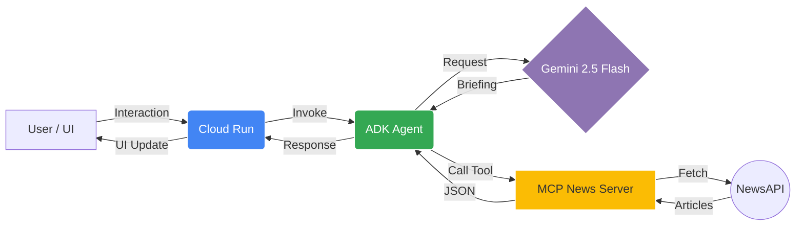

# 📰 News Briefing AI Agent (Track 2)
An AI-powered news briefing agent built with **Google ADK**, **MCP (Model Context Protocol)**, and **Vertex AI (Gemini 2.5 Flash)**.
## 🎯 Project Goal
Demonstrate a real-world data-to-agent integration using the Model Context Protocol to fetch live news and generate AI-curated summaries.
## 🛠️ Architecture
- **Agent Framework:** Google ADK
- **Intelligence:** Gemini 2.5 Flash (via Vertex AI)
- **Tool Protocol:** MCP 
- **Data Source:** NewsAPI.org

## ✨ Key Features
- **Topic-Based Search:** Ask about AI, Tech, Sports, or any interest.
- **AI Bulletins:** Structured briefings with headlines, sources, and links.
- **MCP Integration:** Standardized tool-calling for real-world data.

## 🚀 Usage Examples

#### Request: 
What is the latest AI news?

#### Response: 
* Wall Street Has AI Psychosis - Wired (https://www.wired.com/story/wall-street-has-ai-psychosis/)
* Why people really hate AI - The Verge (https://www.theverge.com/podcast/897900/ai-trust-gap-killer-app-vergecast)
* Wikipedia bans AI-generated articles - The Verge (https://www.theverge.com/tech/901461/wikipedia-ai-generated-article-ban)
* AI companies want to harvest improv actors’ skills to train AI on human emotion - The Verge (https://www.theverge.com/ai-artificial-intelligence/893931/ai-companies-handshake-improv-actors-training-data)
* Signal’s Creator Is Helping Encrypt Meta AI - Wired (https://www.wired.com/story/signals-creator-is-helping-encrypt-meta-ai/)

## Created by Shon Ferrao

